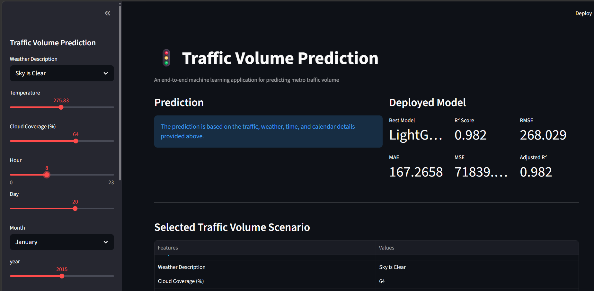
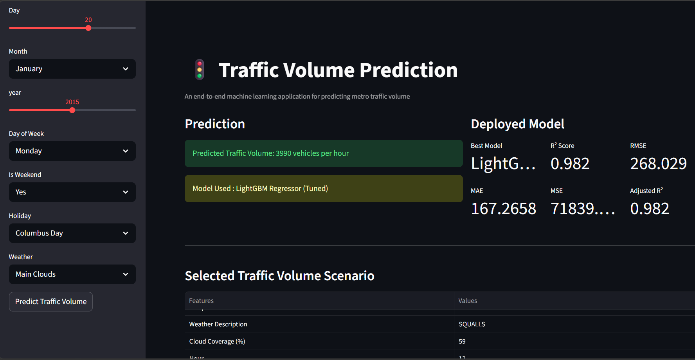
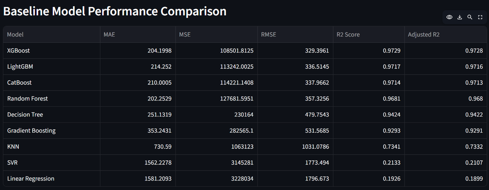
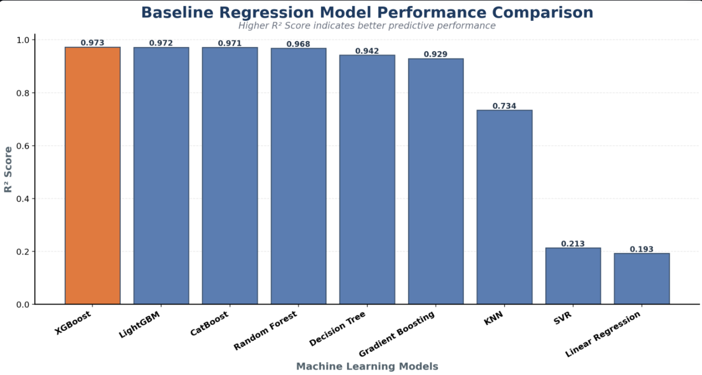
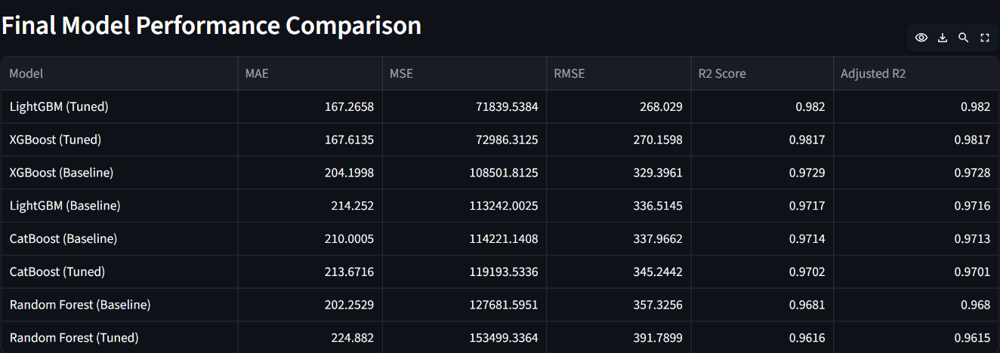
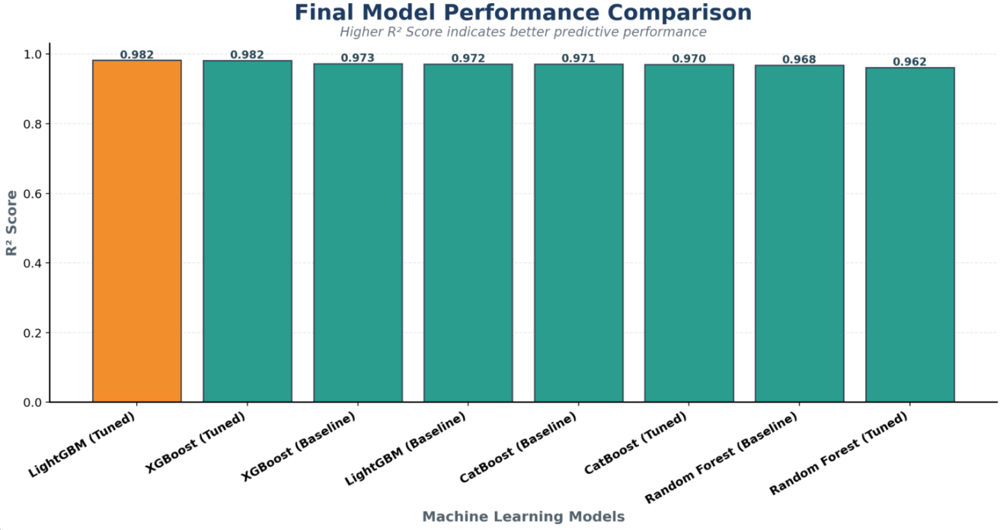
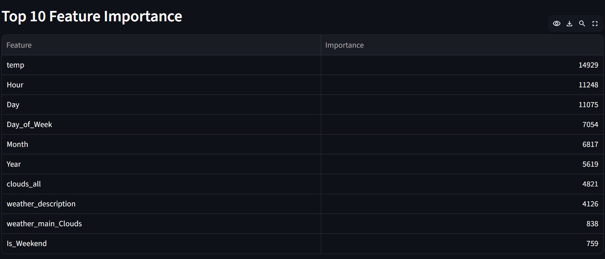
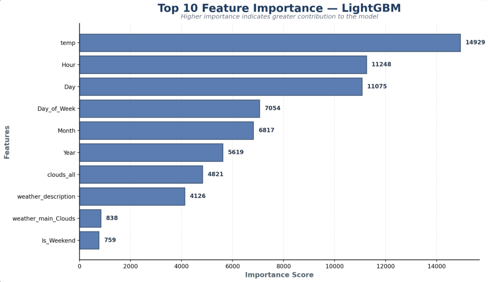

# 🚦 Metro Traffic Volume Prediction

An end-to-end machine learning project for predicting **hourly metro traffic volume** using weather conditions, time-based features, and calendar information.

The project includes data preprocessing, feature engineering, regression model comparison, hyperparameter tuning, feature importance analysis, and deployment using Streamlit.

### 🚀 Live Demo

[**Metro Traffic Volume Prediction — Live App**](https://akhlaque03-metro-traffic-prediction.streamlit.app/)


## 📌 Project Overview

Metro traffic volume varies significantly with changes in weather conditions, time of day, weekdays, weekends, and holidays.

This project uses machine learning regression techniques to predict **hourly traffic volume** based on traffic-related, weather, and calendar features.

Multiple regression models were trained and evaluated, followed by hyperparameter tuning of selected models to identify the best-performing model for deployment.

The final **Tuned LightGBM Regressor** achieved an **R² Score of 0.9820** and was deployed as an interactive Streamlit web application.


## 🎯 Objective

The main objective of this project is to develop an accurate machine learning model for predicting hourly metro traffic volume and deploy it as an interactive web application.

### Key Objectives

* Analyze factors influencing metro traffic volume
* Perform data preprocessing and feature engineering
* Train and compare multiple regression models
* Evaluate models using MAE, MSE, RMSE, R², and Adjusted R²
* Perform hyperparameter tuning on selected models
* Identify the most important features affecting predictions
* Select and deploy the best-performing model
* Provide an interactive interface for real-time traffic volume prediction


## 🔄 Machine Learning Workflow

```text
Data Collection
      ↓
Data Preprocessing
      ↓
Feature Engineering
      ↓
Categorical Feature Encoding
      ↓
Train-Test Split
      ↓
Baseline Model Training
      ↓
Model Evaluation
      ↓
Hyperparameter Tuning
      ↓
Final Model Selection
      ↓
Feature Importance Analysis
      ↓
Model Deployment
      ↓
Streamlit Web Application
```


## 🤖 Models Evaluated

The following regression models were trained and evaluated during the baseline comparison:

* Linear Regression
* Support Vector Regression (SVR)
* K-Nearest Neighbors (KNN)
* Decision Tree Regressor
* Random Forest Regressor
* Gradient Boosting Regressor
* XGBoost Regressor
* LightGBM Regressor
* CatBoost Regressor

After baseline evaluation, **XGBoost, LightGBM, CatBoost, and Random Forest** were further evaluated after hyperparameter tuning.


## 📊 Evaluation Metrics

The regression models were evaluated using the following metrics:

| Metric          | Interpretation                                                  |
| --------------- | --------------------------------------------------------------- |
| **MAE**         | Measures the average absolute prediction error                  |
| **MSE**         | Measures the average squared prediction error                   |
| **RMSE**        | Measures the square root of the average squared error           |
| **R² Score**    | Measures how well the model explains the variance in the target |
| **Adjusted R²** | R² adjusted for the number of predictors used by the model      |

For model selection, **lower MAE, MSE, and RMSE** and **higher R² and Adjusted R²** indicate better performance.


## 📈 Baseline Model Performance

The baseline models were evaluated before hyperparameter tuning.

| Model             |       MAE |         MSE |      RMSE |   R² Score | Adjusted R² |
| ----------------- | --------: | ----------: | --------: | ---------: | ----------: |
| **XGBoost**       |  204.1998 | 108501.8125 |  329.3961 | **0.9729** |  **0.9728** |
| LightGBM          |  214.2520 | 113242.0025 |  336.5145 |     0.9717 |      0.9716 |
| CatBoost          |  210.0005 | 114221.1408 |  337.9662 |     0.9714 |      0.9713 |
| Random Forest     |  202.2529 | 127681.5951 |  357.3256 |     0.9681 |      0.9680 |
| Decision Tree     |  251.1319 |    230164.2 |  479.7543 |     0.9424 |      0.9422 |
| Gradient Boosting |  353.2431 |    282565.1 |  531.5685 |     0.9293 |      0.9291 |
| KNN               |  730.5900 |     1063123 | 1031.0786 |     0.7341 |      0.7332 |
| SVR               | 1562.2278 |     3145281 | 1773.4940 |     0.2133 |      0.2107 |
| Linear Regression | 1581.2093 |     3228034 | 1796.6730 |     0.1926 |      0.1899 |

### Baseline Result

**XGBoost achieved the highest baseline R² Score of 0.9729.**


## 🖥️ Application Screenshots

### Main Application



### Traffic Volume Prediction



### Baseline Model Comparison

#### Comparison Table



#### Performance Graph



### Final Model Comparison

#### Comparison Table



#### Performance Graph



### Feature Importance

#### Feature Importance Table



#### Feature Importance Graph




## 🏆 Final Model Performance

After hyperparameter tuning, the selected models were compared to identify the best-performing model.

| Model                    |          MAE |            MSE |         RMSE |   R² Score | Adjusted R² |
| ------------------------ | -----------: | -------------: | -----------: | ---------: | ----------: |
| **LightGBM (Tuned)**     | **167.2658** | **71839.5384** | **268.0290** | **0.9820** |  **0.9820** |
| XGBoost (Tuned)          |     167.6135 |     72986.3125 |     270.1598 |     0.9817 |      0.9817 |
| XGBoost (Baseline)       |     204.1998 |    108501.8125 |     329.3961 |     0.9729 |      0.9728 |
| LightGBM (Baseline)      |     214.2520 |    113242.0025 |     336.5145 |     0.9717 |      0.9716 |
| CatBoost (Baseline)      |     210.0005 |    114221.1408 |     337.9662 |     0.9714 |      0.9713 |
| CatBoost (Tuned)         |     213.6716 |    119193.5336 |     345.2442 |     0.9702 |      0.9701 |
| Random Forest (Baseline) |     202.2529 |    127681.5951 |     357.3256 |     0.9681 |      0.9680 |
| Random Forest (Tuned)    |     224.8820 |    153499.3364 |     391.7899 |     0.9616 |      0.9615 |

### Selected Model

**Tuned LightGBM Regressor** was selected as the final model because it achieved the highest R² Score and the lowest MAE and RMSE among the evaluated final models.

**R² Score:** 0.9820
**MAE:** 167.2658
**RMSE:** 268.0290
**MSE:** 71839.5384
**Adjusted R²:** 0.9820


## 🔍 Feature Importance

Feature importance was analyzed using the final **LightGBM Regressor** to understand which features contributed most to the model's predictions.

| Rank | Feature             | Importance |
| ---: | ------------------- | ---------: |
|    1 | temp                |      14929 |
|    2 | Hour                |      11248 |
|    3 | Day                 |      11075 |
|    4 | Day_of_Week         |       7054 |
|    5 | Month               |       6817 |
|    6 | Year                |       5619 |
|    7 | clouds_all          |       4821 |
|    8 | weather_description |       4126 |
|    9 | weather_main_Clouds |        838 |
|   10 | Is_Weekend          |        759 |

The analysis shows that **temperature and time-related features** were among the most influential features used by the final model.


## 🛠️ Technology Stack

### Programming Language

* **Python**

### Data Processing

* **Pandas**
* **NumPy**

### Machine Learning

* **Scikit-learn**
* **XGBoost**
* **LightGBM**
* **CatBoost**

### Data Visualization

* **Matplotlib**

### Model Persistence

* **Joblib**

### Application & Deployment

* **Streamlit**
* **Streamlit Community Cloud**

### Development & Version Control

* **Jupyter Notebook**
* **GitHub**
* **GitHub Desktop**


## 📂 Project Structure

```text
metro-traffic-volume-prediction/
│
├── app.py
├── requirements.txt
├── README.md
├── data.csv
├── Final_model_lgbm_tuned.pkl
├── freq_mapping.pkl
├── feature_columns.pkl
├── Metro_Traffic_Volume_Prediction.ipynb
│
└── screenshots/
    ├── main_page.png
    ├── main_prediction_page.png
    ├── baseline_model_comparison_graph.png
    ├── baseline_model_comparison_table.png
    ├── feature_importance_graph.png
    ├── feature_importance_table.png
    ├── final_model_comparison_graph.png
    └── final_model_comparison_table.png
```


## 🚀 Installation & Usage

### 1. Clone the Repository

```bash
git clone https://github.com/akhlaque03/metro-traffic-volume-prediction.git
```

### 2. Navigate to the Project Directory

```bash
cd metro-traffic-volume-prediction
```

### 3. Create a Virtual Environment

```bash
python -m venv venv
```

### 4. Activate the Virtual Environment

**Windows:**

```bash
venv\Scripts\activate
```

### 5. Install Dependencies

```bash
pip install -r requirements.txt
```

### 6. Run the Streamlit Application

```bash
streamlit run app.py
```

The application will then open in your default web browser.


## ☁️ Deployment

The application is deployed using **Streamlit Community Cloud** and connected directly to the GitHub repository.

### Live Application

🚦 **[Open Metro Traffic Volume Prediction](https://akhlaque03-metro-traffic-prediction.streamlit.app/)**

The deployed application allows users to enter traffic, weather, and calendar information and receive a predicted traffic volume from the trained **Tuned LightGBM Regressor**.


## 📌 Key Results

* Evaluated **9 regression algorithms** during baseline model comparison.
* **XGBoost** achieved the highest baseline R² Score of **0.9729**.
* Hyperparameter tuning improved the performance of the selected tree-based models.
* **Tuned LightGBM** achieved the best overall performance.
* Final **R² Score: 0.9820**
* Final **MAE: 167.2658**
* Final **RMSE: 268.0290**
* Time-based features such as **Hour, Day, Day_of_Week, Month, and Year** were among the most important predictors.
* The final model was successfully integrated into a **Streamlit web application**.
* The application is publicly deployed and available through the live demo.


## 👨‍💻 Author

**Akhlaque Alam**

Aspiring Data Scientist with a focus on **Machine Learning, Python, SQL, and Data Science**.

### Project Links

* 🚀 [Live Application](https://akhlaque03-metro-traffic-prediction.streamlit.app/)
* 💻 [GitHub Repository](https://github.com/akhlaque03/metro-traffic-volume-prediction)

---

⭐ If you find this project useful, consider giving the repository a star.
